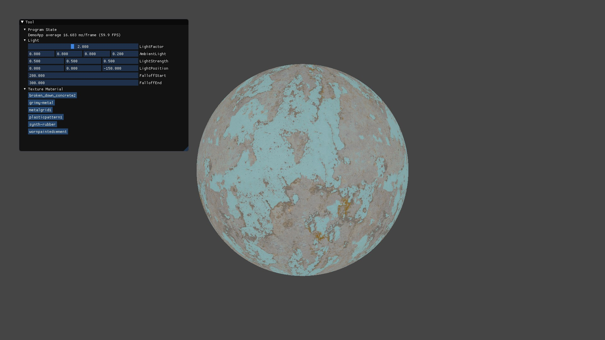
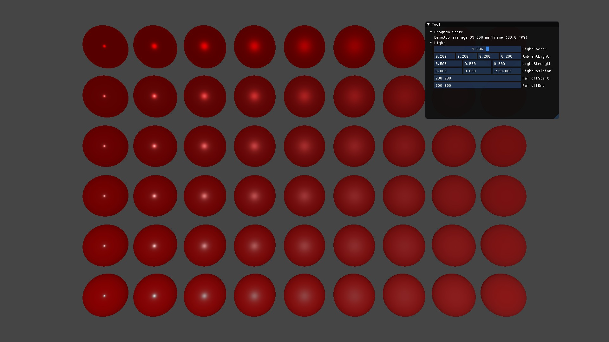

# Code-Red-Demo

Demos for [Code-Red](https://github.com/LinkClinton/Code-Red/tree/master)(A Graphics Interface for DirectX12 and Vulkan).

## List

- [DemoApp](https://github.com/LinkClinton/Code-Red-Demo/tree/master/Demos/DemoApp): Some helper functions and classes. For example, Effect and Shaders.

- [EffectPassDemo](https://github.com/LinkClinton/Code-Red-Demo/tree/master/Demos/EffectPassDemo) : Lighting, PBR, Effect Pass usage from DemoApp.

- [FlowersDemo](https://github.com/LinkClinton/Code-Red-Demo/tree/master/Demos/FlowersDemo) : Bezier Curve Rendering, MSAA in Shader, Blend.

- [ParticlesDemo](https://github.com/LinkClinton/Code-Red-Demo/tree/master/Demos/ParticlesDemo) : Texture Sample, Render to Texture.

- [TriangleDemo](https://github.com/LinkClinton/Code-Red-Demo/tree/master/Demos/TriangleDemo) : Render Triangle, Constant32Bits.

## Screenshots

There are some screen shots of demos.

## References

-  [Code-Red](https://github.com/LinkClinton/Code-Red/tree/master) :A Graphics Interface for DirectX12 and Vulkan.

## Requirement

- [Python3](https://www.python.org/)

## ThirdParties

- [glm](https://github.com/g-truc/glm) : OpenGL Mathematics (GLM) 

- [shaderc](https://github.com/google/shaderc) : A collection of tools, libraries, and tests for Vulkan shader compilation.

- [stb](https://github.com/nothings/stb) : stb single-file public domain libraries for C/C++.